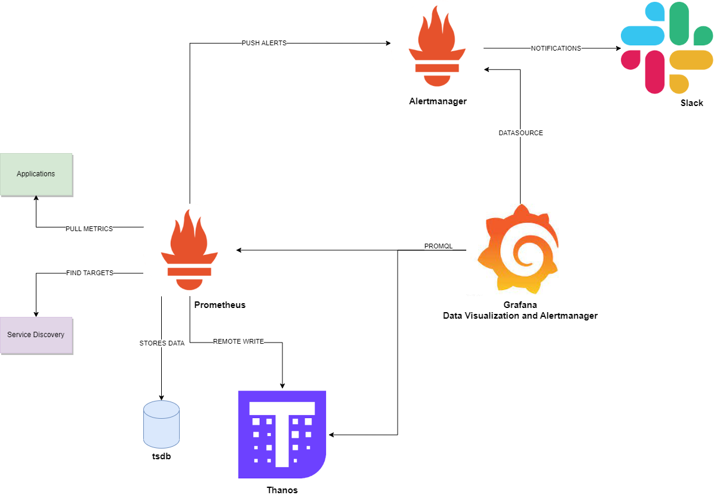
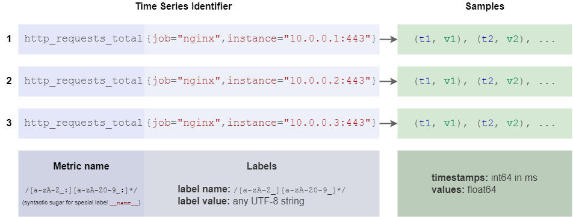

# Treinamento Prometheus + Grafana

Neste material, você terá contato com contéudo que aborda do nível iniciante ao intermediário sobre Prometheus e Grafana.


# Arquitetura

<p align="center">Figure 1: Architecture</p>

# Pre Requisitos
* Docker 24.0.5

# Prometheus
### O que é Prometheus?
Prometheus é uma aplicação open-source de monitoramento e alerta, que coleta e armazena métricas como dados temporais. <br />
Seu banco de dados é TSDB (times series database), no qual são armazenadas as métricas, record-rules e tudo mais.


### Métricas e labels
Prometheus fundamentalmente armazena todos os dados como time series (pontos de dados em ordem de tempo).<br />
Todo time series é unicamente identificado por nome da métrica e opcional pares de chave-valor chamados de labels. <br />
                     ``` 
                     api_http_requests_total{method="POST", handler="/messages"}
                     ``` <br />
Toda combinação de valores únicos representa um novo timeseries, que pode aumentar a quantidade de dados armazenados. Não utilize labels para armazenar dimensões com alta cardinalidade, como  user_IDs.

### Cardinalidade
É a quantidade de valores unicos existem. Exemplo se você tem uma label HTTP methods e tem somente GET e POST a cardinalidade será 2. <br />
Mas se você tem uma métrica com 2 HTTP methods, 7 HTTP paths, 5 machines e considerando que histogram tem cardinalidade 12, então teremos 2x7x5x12=840 <br />

### Samples
Samples formam os dados reais do time series, cada sample consiste de: <br />
- um valor float64 
- um timestamp em milisegundos

<p align="center">Figure 2: Prometheus Datamodel</p>

### Tipos de métricas
O Prometheus oferece 4 tipos de métricas.

##### Count
É uma métrica acumulativa que pode somente aumentar ou se reiniciado a 0 quando aplicação é reiniciada.<br />
    Pode ser utilizada para representar quantidade de requests recebidas, tarefas concluidos, erros<br />
##### Gauge
É uma métrica que representa numeros que podem arbitrariamente subir ou descer.<br />
    Poder ser utilizada para mensurar valores como temperatura, uso de memória corrente<br />
<p>Histogram</p>
É uma métrica que apresenta observações e as contadores em intervalos configuráveis e também fornece a some de todos os valores observados.<br />
    Use histogram para calcular quantil <br />
    Histogram expoe multiplos time series durante um scrape: <br />
        - contador acomulativo  <basename>_bucket{le="<upper inclusive boud>"} <br />
        - total sum  <basename>_sum <br />
        - count <basename>_count{le="+info"}  <br />

    le = less than or equal to <br />
    +inf = o valor total do bucket nao-decrescente, tendo o maior valor e será sempre igual ao valor do count
```bash
        # HELP prometheus_http_request_duration_seconds Histogram of latencies for HTTP requests.
        # TYPE prometheus_http_request_duration_seconds histogram
        prometheus_http_request_duration_seconds_bucket{handler="/",le="0.1"} 25547
        prometheus_http_request_duration_seconds_bucket{handler="/",le="0.2"} 26688
        prometheus_http_request_duration_seconds_bucket{handler="/",le="0.4"} 27760
        prometheus_http_request_duration_seconds_bucket{handler="/",le="1"} 28641
        prometheus_http_request_duration_seconds_bucket{handler="/",le="3"} 28782
        prometheus_http_request_duration_seconds_bucket{handler="/",le="8"} 28844
        prometheus_http_request_duration_seconds_bucket{handler="/",le="20"} 28855
        prometheus_http_request_duration_seconds_bucket{handler="/",le="60"} 28860
        prometheus_http_request_duration_seconds_bucket{handler="/",le="120"} 28860
        prometheus_http_request_duration_seconds_bucket{handler="/",le="+Inf"} 28860
        prometheus_http_request_duration_seconds_sum{handler="/"} 1863.80491025699
        prometheus_http_request_duration_seconds_count{handler="/"} 28860
```

Exemplo para calcular o 90th percentil 
```bash
histogram_quantile(0.9, 
    rate(prometheus_http_request_duration_seconds_bucket[5m])
)

histogram_quantile(0.95, 
    sum(rate(grafana_http_request_duration_seconds_bucket[5m]))
by (le)
)
```

<p>Summary</p>
É uma combinação de outros tipos de métricas. Um summary consiste em dois contadores, e opcionalmente, alguns medidores.
São utilizadas para rastrear o tamanho dos eventos, geralmente quanto tempo eles levam.


### Query
Prometheus possui sua própria linguagem chamada PromQL.
https://prometheus.io/docs/prometheus/latest/querying/functions/
#### Simple
Retorna todos os time series
```bash
http_requests_total
```
#### Vetor
Retorna todos os time series em um média de tempo
```bash
http_requests_total{}[5m]
```

#### funções
Somar a taxa de todas as instancias
```bash
sum by (job) (
  rate(http_requests_total[5m])
)
```

### Recording Rules
É uma boa prática para facilitar a interpretação rápida e também evitar erros ao fazer calculos incorretos ou sem sentido.
```bash
- record: instance_path:requests:rate5m
  expr: rate(requests_total{job="myjob"}[5m])

- record: path:requests:rate5m
  expr: sum without (instance)(instance_path:requests:rate5m{job="myjob"})
```

### Alerting Rules
Permite definir alertas baseado na expressão e enviar notificações sobre alertas firing.
```bash
groups:
- name: example
  rules:
  - alert: HighRequestLatency
    expr: job:request_latency_seconds:mean5m{job="myjob"} > 0.5
    for: 10m
    labels:
      severity: page
    annotations:
      summary: High request latency
```


# Links
https://www.robustperception.io/how-does-a-prometheus-histogram-work/
https://grafana.com/blog/2022/03/01/how-summary-metrics-work-in-prometheus/
https://www.robustperception.io/cardinality-is-key/

**Aplicações**
grafana: http://localhost:3000
prometheus: http://localhost:9090
thanos: http://localhost:10902
cadbisor: http://localhost:8080